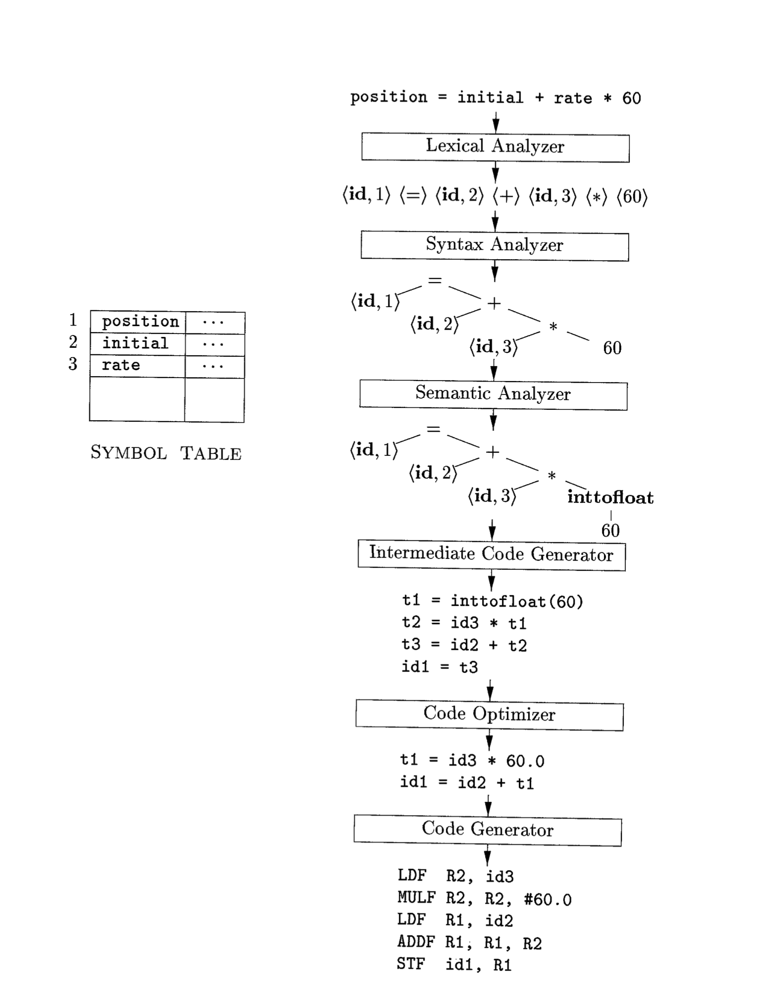

# Chapter 1
## Introduction 
- Program languages provide a bridge between machines and people
- They are the mediums of what allows to fully harness the power of modern technology
- Compilers are what allow us to take the abstraction that makes up programming languages and put it into action
## Language Processors:
- Converts a language from one source language to another source language 
  $SourceLanguage \rightarrow Compiler \rightarrow Target Program$
 In certain cases, the target program can call user input and produce an output 
- In other words:
$$SourceLanguage \rightarrow Compiler \rightarrow Target Program \\
input \rightarrow TargetProgram  \rightarrow output$$

## Intrepreters:
- A bit different from compilers, interpreters aim to produce an output based on inputs specified by the users
## Hybrid Compilers:
- Some programming languages such as Java, utilize a combination both interpreters and compilers to produce an output 
- In the case of Java, a compiler compiles Java files into byte code which is execitable by the JVM
- Large programs tend to compiler programs in piece and use a linker to reference locations within afile
# The Structure of Compiler:
- Now we have a basic understanding of the compiler black box let's explore the mapping process: analysis and synthesis
- Analysis is the process in which a source language is taken and converted into an intermediate reprsentation
- During this process, additional information about the nature of the program is collected in a **symbol table**
- We often call this the front-end of the compiler
- On the other hand, the back-end or synthesis of the compiler is the format in which the intermediate representation is converted to the target program
- In many cases, the analysis and the synthesis process occurs multiple times 
-  Below is what may happen for some given language:
$$
characterStream \rightarrow LexicalAnalyzer \rightarrow TokenStream \rightarrow SyntaxAnalyze \rightarrow  SyntaxTree \\ \rightarrow SemanticAnalyzer \rightarrow syntaxTree \rightarrow IntermediateCodeGenerator \\
IntermediateRepresentation/ SymbolTable \rightarrow MachineIndependentCodeOptimizer \rightarrow \\
IntermediateRepresentation \rightarrow Code Generator\rightarrow targetMachineCode \rightarrow\\
MachineDependentOptimizer \rightarrow TargetMachineCode
$$
## Lexical Analysis
- Lexical Analysis or scanning is the process in which a stream of characters making up some source program is read and group into sequences called **lexemes**
- For each **lexemes**, an output token of the form $<token-name, attribute-value>$ is created
- The attribute-value points to an entry in the symbol table for this token
- Assume we have a source program with the following snippet of code 
**Figure 1.1**
```python 
position = initial + rate * 60
```
1. ```position``` is a lexeme that would be mapped into a token ```<id,,1>``` where id is an abstract symbol standing for identifier and 1 points to the symbol-table entry for an identifier holds information about identifiers, such as its name and type
2. ```=``` is a lexeme that is mapped into the token ```<=>```, the attribute value is ommited since there is no need for the attriute value
3. ```initial``` is a lexeme that is mapped into the token ```<id, 2 >```
4. ```+``` is a lexeme that is mapped into the token ```<+>```
5. ```rate``` is a lexeme that is mapped into the token ```<id,3>```
6. ``` *``` is a lexeme mapped into the token ```<*>```
7. 60 is a lexeme that is mapped into the token ```<60>```
- After we perform our lexical analysis, **figure 1.1** is turned into the following statement:
```<id,1><=><id,2><+><id,3><*><60> ```

## Syntax Analysis:
* After lexical analysis has been performed and the chracters have been grouped into lexemes, the parser utilizes the first components or token name of the tokens generated by the lexical analyzer to build a tree-like representation that visualizes the grammatical structure of the token stream
* We order our tree based on the order of precedence
# Semantic Analysis:
- The semantic analyzer uses a syntax tree and information in symbol table to check the source program for semantic consistentcy with the language definition
- It also gathers type information and saves it in either the syntax tree or symbol table 
- Another important of semantic analysis is type checking which is where the compiler checks if there is matching operands
- An example of this would be an array checking to see if the index of an array is an integer
- Additionally, it would check if there is valid instances of coercion a form a type of conversion
- An example of this would be the conversion of an int to a float during addition of an int to a float
- Assume that our piece of code in figure 1.1 has the variables, initial, rate all initialized as floats, in this case the lexeme 60 may be converted into a float to accomodate for this issue
- Notice how the diagram above has an operation for inttofloat that converts is integer into floating point numbers 
## Intermediate Code Generation:
-  For many compilers, there are many different intermediate representations of the program 
-  During the process of our program in the target language, we may encounter many different interemediate representations such as syntax trees and during this process it's common to to encounter many low level and machine like intermediate representation
## Code Optimization:
- Syntax trees can often be converted to an intermediate code representation however, a lot of times certain optimizations can be made to improve a prexisting representation of code
## Code Generation:
- A code generator takes an input as an intermediate representation of the source program and maps it to a target language
## Symbol-Table Management:
- An essential funciton of a compiler is to record the variable names used in the source program and acollection information about various attributes of each name
- Often times these attributes are stored in a symbol table
## The Grouping of Phases into Phases:
- Compilers can be viewed as a series of multipe compilers working together to create an output
## Programming Languages and Their Evolution:
- The first programming languages can be viewed as common machine instructions grouped into abstractions called assembly language
- Further innovations were made when greater abstractions were made to assembly languages when scientific computing languages like Fortran were created
## Design Philopshies to Keep in Mind:
- Optimize code but preserve original meaning
- Optimization must improve the performance of the programs 
- Compilation time must be kept reasonable
- Consider the use case of the compilers 
## Applications 
- With concepts such as OOP rising to prominence, compiler designers have to figure out how to reduce the large overhead associated with high levle lanbguages
- Innovations in hardware have allowed to exploit memory hierarchy and parallelism to the highest levels
## Parallelism:
- All modern microprocessors utilize instruction level parallelism 
- At a high level, this process is hidden and we assumme instructionsn are executed in a sequential manner
- Very Long Instruction Word machines have instructions that can issue multiple operations in parallel
## Memory Hiearchies:
- A memory hiearchy consists of several layers of storages with different speeds and size
- The closer memory is to processor, the more likely it is smaller and faster
- With limited memory in registers, managing registers efficently is important to optimizing programs
## More is Not Always Better:
- RISC architechture have alloeed for optimization of software at a much higher level than CISC
## Program Translations:
- Certain compilers can convert binary code for one machine to another
## Hardware Synthesis:
- Hardwares can also be mapped utilizing compilers
## Type Checking:
- Type checkng is an effective and well-established technique to catch inconsistency in programs 
## Bounds Checking 
- It's important to check for bounds when ensuring the safety of program
## Static Vs Dynamic:
- A language is said to use a static if issues can be found during compile time
- A language is said to be dynamic if issues can only be decided at run time
- Additionally static variables are said to have a fixed location in memory where the declared variables could be found
## Enviroment and States:
- Environment can be viewed as a mapping from names to locations in the store or location in memory 
- The state is the mapping from location to their values
- Assume we have the following snippet of code 
```C
int i;
void f() {
    int i;
    i = 3;
}
x = i + 1;
```
- As the program executes, the local to i refers to the global variables and adjusts to the i in function f as the code executes
- Additionally the local and the states of i within f can be only accessed within f itself 
## Static Scope and Block Structure:
- Most lanaguages utilize a static scope where scope rules are based on location of where declaration appears in program
- In languages like C++ , C, and Java these scopes are often determine based on where they are declared in blocks 
- Within the block like structures of Java and C, one can view that a block belongs to another block if it is contained within it 
## Explicit Access Control:
- Classes and Structures introduce a new scope for their members 
- If p is an objet of a class with a field x, then the use of the notation p.x refers to x in the context of p
- In the same nature of block like structures in Java and C, the field x declared in class C extends to every subclass of C until a new declaration is made for x
- Keywords like public, private, and protected all provide explicit control over access to member names in superclassses
- Private names are purposely given a scope that includes only the method declaration
- Protected only to subclasses
- PUblic are accessible from outside the class
## Dynamic Scoping:
- Dynamic scoping refers to that local and environment of a variable is associated with the mostly recently used environment of the variable
## Call by Value vs Call by Reference:
- Call by value actually evaluates the value itself, in essence the memory location of the parameter has the value assigned to it
- Cal by reference takes the address of the paramter and moves to the memory address of the paramter
## Aliasing:
- Aliasing is the mechanism in which two parameters may refer to the same location 
- Suppose we have the parameters for the following function: q(x,x)
- In this case, we can alias the values to each other to optimize our compiler
- 
